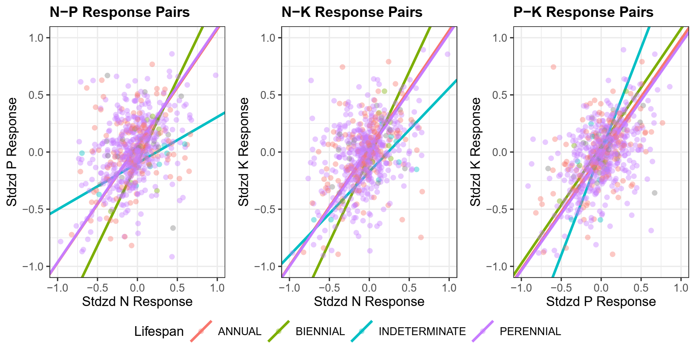
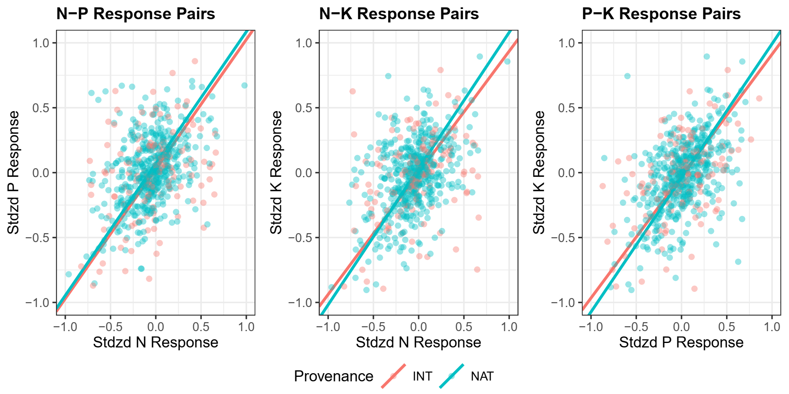

`r if(knitr:::is_latex_output()) '\\appendix'`

`r if(!knitr:::is_latex_output()) '# (APPENDIX) Appendix {-}'` 

<!--
If you feel it necessary to include an appendix, it goes here.
-->


```{r setup_appendix, include=FALSE}
knitr::opts_chunk$set(echo = FALSE, message = FALSE, warning = FALSE)
```

```{r dependencies_appendix}
library(here)
library(knitr)
library(kableExtra)
library(captioner)
library(tidyverse)
library(xtable)
fig_nums_appendix <- captioner(prefix = "Figure A.", auto_space = FALSE)
table_nums_appendix <- captioner(prefix = "Table A.", auto_space = FALSE)

options(xtable.comment = FALSE, xtable.include.rownames=FALSE)
```

```{r data_appendix}
apptab1_1 <-  read_csv("data/App1_1.csv", col_types = "ccccccccccc")
apptab1_2 <-  read_csv("data/App1_2.csv", col_types = "cccccccc")

apptab3_1 <- read_csv("data/App3_1.csv", col_types = "ccccccc")
apptab3_2 <- read_csv("data/App3_2.csv")
apptab3_3 <- read_csv("data/App3_3.csv", col_names = FALSE)
apptab3_4 <- read_csv("data/App3_4.csv",  col_types = "ccccc")
apptab3_5 <- read_csv("data/App3_5.csv", col_types = "ccccccnn")
```
# Appendix 1

```{r, results = "hide"}
table_nums_appendix(name = "tableA1_1")
```

```{r tableA1_1, echo = FALSE, include = TRUE, results = 'asis'}
print(xtable(apptab1_1,
             caption = "Table of sites included in analysis."),
      scalebox = 0.6)
```

```{r tableA1_2, echo = FALSE, include = TRUE, results = 'asis'}
colnames(apptab1_2) <- c("Site Name",
                         "$\\rho$(N-P)",
                         "$\\rho$(N-K)",
                         "$\\rho$(P-K)",
                         "$\\Delta$N",
                         "$\\Delta$P",
                         "$\\Delta$K",
                         "D")
print(xtable(apptab1_2,
             caption = "Table of sites, pairwise correlations between community responses to different treatments ($\\rho$), rate of community change in response to treatment ($\\Delta$), and estimated response dimensionality (D). Significant (P < 0.05) magnitudes of community response are labelled with $\\*$"),
      scalebox = 0.6, sanitize.text.function=function(x){x})
```


```{r, results = "hide"}
fig_nums_appendix(name = "app-1-1")
```

{height=40%}


```{r, results = "hide"}
fig_nums_appendix(name = "app-3-1")
```

{height=40%}


```{r, results = "hide"}
table_nums_appendix(name = "tableA1_2")
```

# Appendix 2

# Appendix 3

```{r, results = "hide"}
table_nums_appendix(name = "tableA3_1")
```

```{r tableA3_1, echo = FALSE, include = TRUE, results = 'asis'}
apptab3_1[is.na(apptab3_1)] = ' '
colnames(apptab3_1)[c(1,7)] = c("Source", "P")
xtable(apptab3_1,
             caption = "Heuristics used to determine best number of clusters to use in partitioning, K. Summary of the best performing K for 8 different clustering indices.")
```


```{r, results = "hide"}
table_nums_appendix(name = "tableA3_3")
```

```{r tableA3_2, echo = FALSE, include = TRUE, results = 'asis'}
colnames(apptab3_3) <- apptab3_3[1,]
print(xtable(apptab3_3[-1,], 
             caption = "Rank summary table of performance across different clustering indices."),
      scalebox = 0.7)
```

\pagebreak

Clustering Index Ranking Method:  
1. Hartigan: Choose value K with maximum index difference between K and K-1.
2. CH: Choose maximum value among orders of K considered.
3. Beale: Choose minimum value of K such that the critical value of the index is less than alpha = 0.05. Other values whose critical value is less than alpha are ranked in order of significance.
4. KL: Choose maximum value among orders of K considered.
5. Cindex: Choose minimum value among orders of K considered.
6. DB (Davies and Bouldin): Choose minimum value among orders of K considered.
7. Silhouette: Choose maximum value among orders of K considered.
8. Duda: Choose minimum value of K such that the critical value of the index is less than alpha = 0.05. Other values whose critical value is less than alpha are ranked in order of significance.

\pagebreak

```{r, results = "hide"}
table_nums_appendix(name = "table3_4")
```

```{r table3_4, echo = FALSE, include = TRUE, results = 'asis'}
colnames(apptab3_4)[1] = " "
print(xtable(apptab3_4, 
             caption = "Contingency table of observed transitions between state assignments between 2008-2018. For each plot observation of a state assignment in year t (rows), data shows the frequency of state assignments (columns) of the same plot in a subsequent year (t + 1). Diagonal values represent the frequency of a given state retaining its assignment (persistence), while off-diagonal values represent transitions in state assignment. Changes in assignment frequency were highly non-random (χ2 = 392.017, df = 9, P < 0.001)."),
      scalebox = .7)
```

  
  
  
  

```{r, results = "hide"}
table_nums_appendix(name = "table3_5")
```

```{r table3_5, echo = FALSE, include = TRUE, results = 'asis'}
colnames(apptab3_5) = c("Model", "DF", "Priority", "1 Year SPEI", "2 Year SPEI", "3 Year SPEI", "deltaAIC", "AIC")
xtable(apptab3_5[-1,],
             caption = "AIC model comparison used to select the best fit multi-state model from a series of candidates. Covariates include “Priority Effects” – the effect of initial seeding mixture representation of indicator species correlated with cluster assignments – and “1-“, “2-“, and “3-year SPEI” – a standardized measure of drought stress computed over 1, 2, and 3 cumulative water year intervals, respectively. DF corresponds to the number of parameters estimated within the transition matrix, including baseline transition probabilities and effects of covariates.")
```


```{r, results = "hide"}
fig_nums_appendix(name = "app-3-1")
```

{height=50%}

```{r, results = "hide"}
fig_nums_appendix(name = "app-3-2")
```

{height=80%}


```{r, results = "hide"}
fig_nums_appendix(name = "app-3-3")
```

{height=80%}
