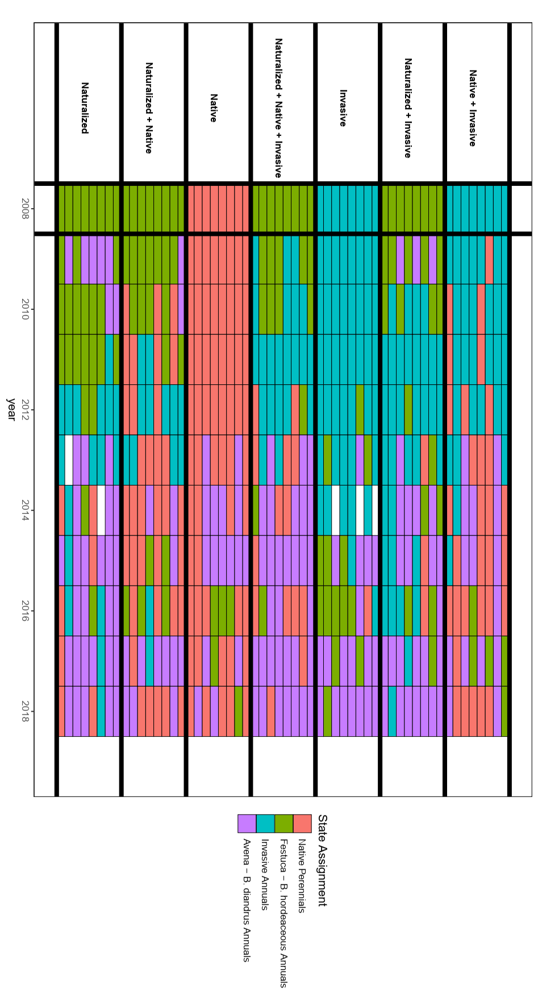

`r if(knitr:::is_latex_output()) '\\appendix'`

`r if(!knitr:::is_latex_output()) '# (APPENDIX) Appendix {-}'` 

<!--
If you feel it necessary to include an appendix, it goes here.
-->


```{r setup_appendix, include=FALSE}
knitr::opts_chunk$set(echo = FALSE, message = FALSE, warning = FALSE)
```

```{r dependencies_appendix}
library(here)
library(knitr)
library(kableExtra)
library(captioner)
library(tidyverse)
library(xtable)
fig_nums_appendix <- captioner(prefix = "Figure A.", auto_space = FALSE)
table_nums_appendix <- captioner(prefix = "Table A.", auto_space = FALSE)

options(xtable.comment = FALSE, xtable.include.rownames=FALSE)
```

```{r data_appendix}
apptab1_1 <-  read_csv("data/App1_1.csv", col_types = "ccccccccccc")
apptab1_2 <-  read_csv("data/App1_2.csv", col_types = "cccccccc")

apptab2_1 <- read_csv("data/App2_1.csv", col_types = "ccc")
apptab2_2 <- read_csv("data/App2_2.csv", col_types = "ccccccc")
apptab2_3 <- read_csv("data/App2_3.csv", col_types = "ccccccc")
apptab2_4 <- read_csv("data/App2_4.csv")
apptab2_5 <- read_csv("data/App2_5.csv")

apptab3_1 <- read_csv("data/App3_1.csv", col_types = "ccccccc")
apptab3_2 <- read_csv("data/App3_2.csv")
apptab3_3 <- read_csv("data/App3_3.csv", col_names = FALSE)
apptab3_4 <- read_csv("data/App3_4.csv",  col_types = "ccccc")
apptab3_5 <- read_csv("data/App3_5.csv", col_types = "cccccccc")
```

# Chapter 1 Supporting Information

```{r, results = "hide"}
table_nums_appendix(name = "tableA1_1")
```

```{r tableA1_1, echo = FALSE, include = TRUE, results = 'asis'}
print(xtable(apptab1_1,
             caption = "Table of sites included in analysis."),
      scalebox = 0.6)
```

```{r tableA1_2, echo = FALSE, include = TRUE, results = 'asis'}
colnames(apptab1_2) <- c("Site Name",
                         "$\\rho$(N-P)",
                         "$\\rho$(N-K)",
                         "$\\rho$(P-K)",
                         "$\\Delta$N",
                         "$\\Delta$P",
                         "$\\Delta$K",
                         "D")
print(xtable(apptab1_2,
             caption = "Table of sites, pairwise correlations between community responses to different treatments ($\\rho$), rate of community change in response to treatment ($\\Delta$), and estimated response dimensionality (D). Significant (P < 0.05) magnitudes of community response are labelled with *."),
      scalebox = 0.6, 
      sanitize.text.function=function(x){x})
```


```{r, results = "hide"}
fig_nums_appendix(name = "app-1-1")
```

{height=40%}


```{r, results = "hide"}
fig_nums_appendix(name = "app-3-1")
```

{height=40%}


```{r, results = "hide"}
table_nums_appendix(name = "tableA1_2")
```

# Chapter 2 Supporting Information


```{r, results = "hide"}
fig_nums_appendix(name = "app-2-1")
```

{height=27% width=90%}


```{r, results = "hide"}
fig_nums_appendix(name = "app-2-2")
```

{height=60% width=80%}


```{r, results = "hide"}
fig_nums_appendix(name = "app-2-5")
```

![Effect of fertilization on species richness and spatial aggregation as a function of sampling scale in 2017 and 2018, presented as a log response ratio. In subplot a, the solid black line corresponds to mean estimated effects under spatially explicit (“empirical”) sample accumulation, while dashed line reflects the median of mean diversity effects under randomized sample accumulation. Shaded areas correspond to Bonferroni-adjusted 95% confidence intervals of mean diversity response across 10,000 random sample accumulation curves. Colored lines denote individual responses of each block. In subplot b, lines correspond to the net effects of spatial aggregation on estimated response, calculated as the observed log-response ratio relative to the median value across bootstrap samples. Shaded areas correspond to Bonferroni-adjusted 95% confidence intervals of aggregation effects on mean diversity response across 10,000 random sample accumulation curves. \label{app-2-5}](figure/AppFig2_5.png){height=60% width=80%}


```{r, results = "hide"}
table_nums_appendix(name = "tableA2_1")
```

```{r tableA2_1, echo = FALSE, include = TRUE, results = 'asis'}
xtable(apptab2_1,
             caption = "Taxon abbreviations and functional types in pre-treatment sampling")
```


```{r, results = "hide"}
fig_nums_appendix(name = "app-2-3")
```

{height=35%}


```{r, results = "hide"}
fig_nums_appendix(name = "app-2-4")
```

{height=35%}


```{r, results = "hide"}
table_nums_appendix(name = "tableA2_2")
```

```{r tableA2_2, echo = FALSE, include = TRUE, results = 'asis'}
apptab2_2$P = paste0(apptab2_2$P, apptab2_2$X7)
apptab2_2$P <- gsub("NANA", "",apptab2_2$P)
xtable(apptab2_2[,1:6],
             caption = "PERMANOVA of Compositional Variation -- MCLA")
```

```{r, results = "hide"}
table_nums_appendix(name = "tableA2_3")
```

```{r tableA2_3, echo = FALSE, include = TRUE, results = 'asis'}
apptab2_3$P = paste0(apptab2_3$P, apptab2_3$X7)
apptab2_3$P <- gsub("NANA", "",apptab2_3$P)
xtable(apptab2_3[,1:6],
             caption = "PERMANOVA of Compositional Variation -- SFREC")
```


```{r, results = "hide"}
table_nums_appendix(name = "tableA2_4")
```

```{r tableA2_4, echo = FALSE, include = TRUE, results = 'asis'}
print(xtable(apptab2_4,
             caption = "Summary of identified species, functional group, origin (native/introduced) mean cover in control plots, and average net change in treatment (+N) plot at MCLA. Sorted by mean relative cover in control plots in 2019 sampling."),
       scalebox = .55)
```


```{r, results = "hide"}
table_nums_appendix(name = "tableA2_5")
```

```{r tableA2_5, echo = FALSE, include = TRUE, results = 'asis'}
print(xtable(apptab2_5,
             caption = "Summary of identified species, functional group, origin (native/introduced) mean cover in control plots, and average net change in treatment (+N) plot at SFREC. Sorted by mean relative cover in control plots in 2019 sampling."),
       scalebox = .55)
```


# Chapter 3 Supporting Information

```{r, results = "hide"}
table_nums_appendix(name = "tableA3_1")
```

```{r tableA3_1, echo = FALSE, include = TRUE, results = 'asis'}
apptab3_1[is.na(apptab3_1)] = ' '
colnames(apptab3_1)[c(1,7)] = c("Source", "P")
xtable(apptab3_1,
             caption = "Permutational ANOVA (PERMANOVA) output of variance in plot community composition in the first year of sampling.")
```


```{r, results = "hide"}
table_nums_appendix(name = "tableA3_3")
```

```{r tableA3_2, echo = FALSE, include = TRUE, results = 'asis'}
colnames(apptab3_3) <- apptab3_3[1,]
print(xtable(apptab3_3[-1,], 
             caption = "Rank summary table of performance across different clustering indices."),
      scalebox = 0.7)
```

\pagebreak

### Clustering Index Ranking Methods:

The following provides brief descriptions of clustering heuristics used to evaluate K in K-medoids clustering. 

For more detail, see @Charrad2014.

* __Hartigan__: Choose value K with maximum index difference between K and K-1. 
* __CH__: Choose maximum value among orders of K considered. 
* __Beale__: Choose minimum value of K such that the critical value of the index is less than alpha = 0.05. Other values whose critical value is less than alpha are ranked in order of significance. 
* __KL__: Choose maximum value among orders of K considered. 
* __Cindex__: Choose minimum value among orders of K considered. 
* __DB__ (Davies and Bouldin): Choose minimum value among orders of K considered. 
* __Silhouette__: Choose maximum value among orders of K considered. 
* __Duda__: Choose minimum value of K such that the critical value of the index is less than alpha = 0.05. Other values whose critical value is less than alpha are ranked in order of significance. 


\pagebreak

```{r, results = "hide"}
table_nums_appendix(name = "table3_4")
```

```{r table3_4, echo = FALSE, include = TRUE, results = 'asis'}
colnames(apptab3_4)[1] = " "
print(xtable(apptab3_4, 
             caption = "Contingency table of observed transitions between state assignments between 2008-2018. For each plot observation of a state assignment in year t (rows), data shows the frequency of state assignments (columns) of the same plot in a subsequent year (t + 1). Diagonal values represent the frequency of a given state retaining its assignment (persistence), while off-diagonal values represent transitions in state assignment. Changes in assignment frequency were highly non-random ($\\chi^2$ = 392.017, df = 9, P < 0.001)."),
      scalebox = .7,
      sanitize.text.function=function(x){x})
```
  

```{r, results = "hide"}
table_nums_appendix(name = "table3_5")
```

```{r table3_5, echo = FALSE, include = TRUE, results = 'asis'}
colnames(apptab3_5) = c("Model", "DF", "Priority", "1 Year SPEI", "2 Year SPEI", "3 Year SPEI", "deltaAIC", "AIC")
print(xtable(apptab3_5[-1,],
             caption = "AIC model comparison used to select the best fit multi-state model from a series of candidates. Covariates include “Priority Effects” – the effect of initial seeding mixture representation of indicator species correlated with cluster assignments – and “1-“, “2-“, and “3-year SPEI” – a standardized measure of drought stress computed over 1, 2, and 3 cumulative water year intervals, respectively. DF corresponds to the number of parameters estimated within the transition matrix, including baseline transition probabilities and effects of covariates."),
       scalebox = .8)
```


```{r, results = "hide"}
fig_nums_appendix(name = "app-3-1")
```

{height=40% width=80%}

```{r, results = "hide"}
fig_nums_appendix(name = "app-3-2")
```

{height=70% width=95%}


```{r, results = "hide"}
fig_nums_appendix(name = "app-3-3")
```

{height=85% width=70%}
